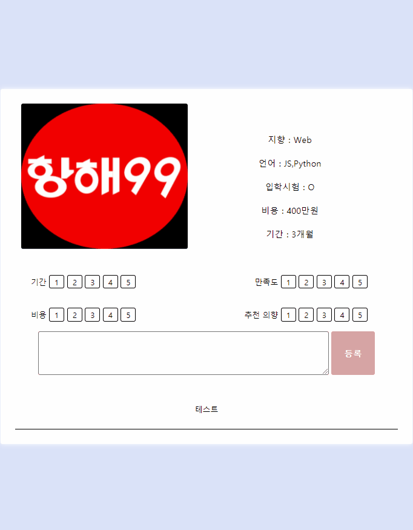
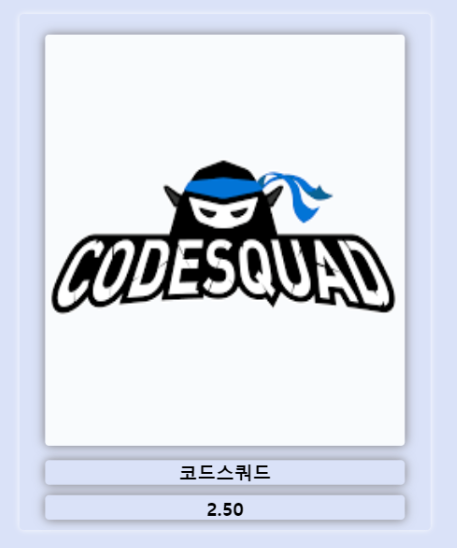

# 👆 What's your choice?

국내에서 운영되고 있는 여러 software Bootcamp 정보를 모아 한 눈에 비교하고, 수강생들의 후기 및 각 Bootcamp별 평점을 확인할 수 있는 웹 어플리케이션 입니다.

 

# 👨🏻‍🤝‍👨🏻 팀원

-   윤상준
-   김재용
-   배재경
-   정가람

 

# 📅 프로젝트 기간

-   5일 (21.09.13 ~ 21.09.17)

 

# ⚙️ 사용 기술 및 환경

## Project Structures

-   flask 서버를 기반으로 jinja2 templete engine 을 이용한 서버사이드렌더링 구조

## 언어

-   python 3
-   MongoDB
-   JavaScript

## 프레임워크 및 라이브러리

-   flask
-   JQuery
-   jinja
-   template engine

 

# 🔎 Link

http://projectstudy.shop/

 

# 🎥 실행영상

 

# 🎮 주요 기능

## 1. 로그인, 회원가입

-   회원가입 페이지에서 새로운 회원 정보 등록 요청 시 작성된 사용자 입력값을 받아 서버로 전달 및 db에 저장

-   로그인 요청시 유효한 사용자라면 db에 저장된 사용자 데이터를 통해 입력된 값과 일치하는지 확인 후 회원 인증

-   전달 된 사용자 값 중에서 password를 안전하게 보관할 수 있도록 암호화하는 해싱 알고리즘 (bcrypt)을 통해 새로운 형태로 보관할 수 있다.

-   사용자의 정보는 서버의 시크릿키와 jwt를 통해 인코딩되고 json 형태로 주고받고 싶은 다양한 데이터를 입력하여 주고 받을 수 있으며 유효성을 확인할 수 있다.

## 2. 리뷰 작성, 평점💯 부여 및 등록

-   2-1. 기간, 만족도, 비용, 추천의향 점수 선택 및 코멘트 작성 후 등록

-   리뷰 작성 및 점수 부여 시

-   2-2. 각 부트캠프 별 리뷰 점수의 평균 확인

 

# 🎮 문제 및 해결

## 1. 사용자 인증 권한

-   부트캠프 리뷰 등록을 위해 필요한 정보를 받아 가입시 사용자 정보로 등록하고 해당 api에서 토큰을 불러와서 사용자정보를 확인할 수 있게 함

## 2. 평점의 평균을 어떻게 구할 것인가?

-   서버측에서 구하려고 했으나 로직이 매우 복잡해졌고 클라이언트측에서 계산하기로 결정
-   리뷰작성페이지에서 작성 후 ajax로 서버측에 점수 POST
-   메인페이지에서 점수 GET 후, 평균 계산하여 출력

## 3. 깃 브랜치를 통한 협업 방법?

-   브랜치 병합시 지속적으로 충돌 발생
-   master 브랜치 생성하고 각자 브랜치에서 푸쉬 후에 회의를 통해 pr 결정 후에 마지막 병합(merge)

## 4. 회의를 통해 최대한 로직을 직접 구현하려고 노력함

-   강의자료 코드 copy & paste에 의존하지 않으려고 함
-   부트스트랩 혹은 추가적인 style 프레임워크를 사용하지 않고 css를 사용한 스타일링 구현
-   JQuery onclick 함수를 통한 HTML 태그 제어 방식을 피하기 위해서, HTML form 태그의 POST method 사용하여 서버로 데이터 전송

## 5. 환경 변수 설정

-   사용자 인증 및 배포 서버 등 코드에 직접 노출되면 안되는 정보를 환경변수로 설정하여 사용
-   config 파일을 생성해서 지정하는 방식이 작동하지 않아 python-dotenv를 설치하여 .env .flaskenv setting.py 별도의 파일을 만들어 환경 변수 설정
